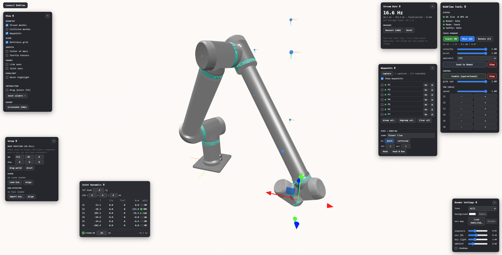

---

# Robot Viewer

[](LICENSE)
[](#)
[](#)
[](https://threejs.org/)
[](https://vitejs.dev/)
[](https://orrerium.web.app)

A web-based 3D viewer, editor and motion-planning workbench for robot models. It runs
entirely in the browser (no install, no server) on top of [Three.js](https://threejs.org/)
and a WebAssembly build of [MuJoCo](https://mujoco.org/) — load a robot description,
inspect and pose it, evaluate dynamics, and (optionally) drive a live robot through a
teach-and-waypoint workflow.

> **About this fork.** This is an independent fork of
> [fan-ziqi/robot_viewer](https://github.com/fan-ziqi/robot_viewer) that adds an
> interactive teach/IK/dynamics workbench and an optional **RobFlow integration layer**
> for connecting to a live robot session. See [Disclaimer](#disclaimer) for trademark and
> affiliation notes.

**Live instance:** https://orrerium.web.app — all model processing happens in your browser;
your models never leave your device.

---

## Features

### Model loading & visualization
- **Formats:** URDF, [Xacro](http://wiki.ros.org/xacro) (macro expansion + conditionals),
  MJCF (MuJoCo XML), USD *(partial)*, plus glTF/GLB, STL, OBJ and Collada meshes.
- **Robot types:** serial kinematic chains (parallel mechanisms not supported).
- **View panel** — toggle visual vs. **collision** geometry (real convex-decomposition
  meshes), center-of-mass markers and inertia ellipsoids, link/joint coordinate frames,
  hover-highlight a link to read its name and mass, and save a PNG screenshot.
- **Built-in code editor** (CodeMirror) with syntax highlighting and live preview.
- **Scene management** — file tree and scene-graph view of the model hierarchy.

### Posing, kinematics & IK
- Per-joint sliders and drag-to-rotate (forward kinematics).
- MuJoCo-backed **forward kinematics** and a damped-least-squares **inverse kinematics**
  solver (full 6-DOF: position + orientation targets).
- A draggable **TCP gizmo** with live IK preview, in Move or Rotate mode.

### Dynamics
- Live per-joint **dashboard**: angle, velocity, acceleration, torque, motor current, and
  **two utilization bars** — *mechanical* (torque vs. the gearbox limit) and *electrical*
  (motor current vs. a speed-dependent drive limit) — plus an **i²t thermal** indicator for
  sustained load.
- Inverse-dynamics torque from MuJoCo, optionally extended by a **motor model** (joint
  friction + reflected rotor inertia) so the numbers reflect a real geared joint rather than
  an idealized rigid body. A toggle switches between the two; a velocity/acceleration
  estimator with an optional fixed-Δt smoothing interval feeds it.
- Editable **TCP payload(s)** (mass + center-of-mass offset) — a manual TCP load, an imported
  gripper tool, and the **live RobFlow-reported payload** coexist and are **summed**, each shown
  as its own marker sphere at its CoM — plus **base-orientation-aware gravity** (wall/ceiling
  mounts); all reflected in the torque, current and utilization. In a live session the dynamics
  panel shows what payload RobFlow reports (mass, CoM, and whether a full inertia tensor was
  received via `payloadInertialParameters`) and that it is being applied.
- See [How joint dynamics are computed](#how-joint-dynamics-are-computed) for the exact model.

### Cell setup
- **Movable robot base** (world-frame inverse-transform) with the base pose persisted
  across reloads.
- Load and align a **scene mesh (GLB)** in the world frame.
- **End-effector import** — align a tool mesh and set its mass, CoM and optional
  tool-tip TCP.
- Configurable per-joint range.

### Teach & waypoints
- A **teach pendant**: gizmo-driven posing with gated *Send* (velocity / acceleration /
  approach) and *Stop* controls.
- **Waypoints & flow round-trip** — an ordered sequence editor that pulls a RobFlow flow
  (load any flow → its joint/cartesian moves, delays and payloads appear as markers + rows in
  execution order) and pushes it back with inline poses (update-in-place via PATCH). Per row:
  switch joint↔cartesian (colour-coded), set velocity / acceleration / blending; insert **delay**
  and **payload** steps; drag to reorder. Consecutive same-mode moves export as one node; a
  delay/payload/mode-change starts a new node; the body loops with a cycle-time marker. Each
  waypoint stores a world-frame TCP pose (so it stays put when the base moves) plus a joint
  snapshot; a multi-seed reachability retry avoids false "unreachable" results after base moves.

### Rendering
- ACES / Neutral tone mapping with image-based lighting for a clean, metallic look.
- Load your own **HDRI/EXR** environment map, or use the built-in **procedural studio
  environment** (used by default when no HDRI is present).
- Exposure, environment, light and shadow controls; a perceptual environment-intensity
  slider; reference-grid toggle.

### UX
- Draggable, minimizable panels with persisted positions.
- Connection credentials and session persisted across reloads.

---

## RobFlow integration (optional)

In addition to offline viewing, the app can connect to a **RobFlow** robot session to
mirror and drive a live robot:

- **Connect** with an access token; the app resolves a session and opens a live link.
- **Live state** — stream joint angles over WebSocket into the viewer, with a stream-rate
  meter and diagnostics; sessions reconnect/persist across reloads.
- **Drive** — send teach-pendant moves, and push captured waypoints (joint- or
  Cartesian-space, optionally variable-bound) to a flow.

This integration is implemented entirely against RobFlow's own network interfaces using
credentials **you** supply at runtime. No RobFlow/RobCo software, assets, or credentials are
bundled in this repository. If you don't use RobFlow, every feature above except this
section works fully offline. See the [Disclaimer](#disclaimer).

---

## How joint dynamics are computed

The Dynamics dashboard turns a stream of joint **positions** into per-joint torque, motor
current and utilization. It all runs in the browser, **per joint**, using parameters read
from each module's own descriptor (mass/inertia, gear ratio, friction coefficients, motor
torque constant, current limits) — drive sizes vary widely, so nothing is a global constant.

### 1. Velocity & acceleration from positions
The stream carries joint **positions** only. Plain finite differences are noisy in
acceleration, so a short sliding window per joint is fit with a least-squares quadratic
`q(t) ≈ a + b·τ + c·τ²`; at the latest sample velocity = `b` and acceleration = `2c`. A fixed
sample interval Δt can be assumed instead of wall-clock arrival times to reject transport
jitter (toggle + interval in the panel).

### 2. Rigid-body torque (MuJoCo inverse dynamics)
A dynamics-only MuJoCo model is built from the module masses, inertias and kinematics. For
the joint state `(q, q̇, q̈)`, `mj_inverse` returns the rigid-body Newton–Euler torque `τ_NE`
per joint (gravity + link inertia + Coriolis). Gravity is expressed in the robot **base
frame**, so tilting the base (wall/ceiling mount) changes the static hold torque correctly,
and any TCP **payloads** (mass + CoM — a manual TCP load and/or an imported gripper) are each
welded at the flange as their own body, so MuJoCo sums their gravity and inertial torques.

### 3. Motor model (optional, on by default)
Rigid-body torque alone describes an idealized arm; a real geared joint also fights friction
and must accelerate its own rotor. With the motor model on, two terms are added per joint:

- **Reflected rotor inertia:** `τ_inertia = q̈ · N² · J_motor`  (`N` = gear ratio, `J_motor` = rotor inertia)
- **Friction:** `τ_friction = c_v·q̇ + (c_c + c_load·τ_NE²) · sin(atan(k·q̇))`
  - `c_v` viscous and `c_c` Coulomb coefficients (per joint); `c_load` an optional
    load-dependent term (`τ_NE` is the rigid-body torque from step 2).
  - `sin(atan(k·q̇))` is a smooth `sign(q̇)` (→ ±1) so Coulomb friction doesn't chatter around
    zero speed; `k` sets how sharply it engages.

Total joint torque is **`τ = τ_NE + τ_inertia + τ_friction`**. At rest (`q̇ = q̈ = 0`) both
added terms vanish, so a static pose shows the pure gravity/payload hold torque. Turning the
motor model **off** reproduces the idealized rigid-body torque (useful for comparison).

### 4. Motor current
Joint torque maps to motor torque through the gear, and motor torque to current through the
torque constant `Kt` (linear region — no field weakening, no separate gear-efficiency factor):

```
τ_motor = τ / N            i_q = τ_motor / Kt = τ / (N · Kt)
```

### 5. Two utilizations — mechanical vs. electrical
These are **independent ceilings**, so both are shown:

- **Mechanical** = `|τ| / τ_peak`, against the joint's gearbox peak torque.
- **Electrical** = `|i_q| / i_avail(q̇)`. The drive's current limit `i_max` is **derated with
  speed** by back-EMF: as the joint spins up, available voltage — and therefore current and
  torque — falls, reaching zero at the motor's no-load speed `ω₀`:

  ```
  i_avail(q̇) = i_max · max(0, 1 − N·|q̇| / ω₀)
  ```

  At standstill this is simply `|i_q| / i_max`; near top speed it tightens sharply. This is
  why the binding limit can switch from mechanical (low speed) to electrical (high speed).

### 6. i²t thermal (overload) index
A motor tolerates brief overcurrent but accumulates heat. The dashboard reproduces the
drive's i²t motor-overload model: a per-joint heat index `H` integrates the copper-loss
excess over the continuous (rated) current and reaches 100% (the limiting threshold) after
running at the maximum current for a per-motor *peak time* `t_peak`:

```
H ← clamp( H + 100 · (i_q² − i_rated²) / ((i_max² − i_rated²) · t_peak) · Δt , 0, 250 )   [%]
```

It charges above the rated current, recovers (more slowly) below it, and is drawn as a thin
thermal underline on the current bar. Unlike the instantaneous bars it captures **sustained**
load — short spikes are tolerated, a held overload climbs toward the limit.

### Notes & limitations
- The stream carries **commanded (desired)** joint angles, so this is *planned* utilization:
  smooth and noise-free, but it does not reflect real tracking error or external disturbances.
- Friction, inertia, current and overload parameters come from the robot's per-module data
  and the drive's documented behavior; the no-load speeds and overload time constants are a
  small built-in per-motor table. Treat the electrical figures as well-grounded **estimates**,
  not certified drive readings.
- Velocity and especially acceleration are estimated from positions, so the
  acceleration-dependent term (rotor inertia) is the noisiest; the fixed-Δt smoothing helps.

---

## Getting started

Requires **Node 24** (20+ works) and **pnpm 9** (`corepack enable pnpm`).

```bash
git clone https://github.com/zorian-f/robot_viewer.git
cd robot_viewer
corepack enable pnpm
pnpm install

pnpm dev        # http://localhost:3000
pnpm build      # production build -> dist/
pnpm preview    # serve the built dist/ locally
```

The dev server sets `COOP`/`COEP` headers, required for the USD WebAssembly viewer's
`SharedArrayBuffer`; the production host mirrors this.

---

## Deployment

Hosted on **Firebase Hosting** and deployed automatically by GitHub Actions
([`.github/workflows/firebase-hosting-deploy.yml`](.github/workflows/firebase-hosting-deploy.yml)):

| Branch | Target | URL |
|---|---|---|
| `main` | Production | https://orrerium.web.app |
| `develop` | Shared dev preview | a stable `orrerium--develop-…web.app` channel |

Every push builds and deploys the app automatically — there are no manual deploy steps.
Per-pull-request preview deploys can additionally be enabled so each PR publishes its own
temporary preview URL.

---

## Contributing

Contributions are welcome. The branch model:

- **`main`** — production; always releasable, changed only via pull request.
- **`develop`** — shared integration branch backing the dev preview.
- **Feature work** — branch off `develop` (`feat/short-description`), commit using
  [Conventional Commits](https://www.conventionalcommits.org/) (`feat:`, `fix:`,
  `refactor:`, `docs:`, `chore:`, `ci:`, `perf:`), then open a **PR into `develop`**.
  Releases go out via a `develop` → `main` PR.

New contributors: see [ONBOARDING.md](ONBOARDING.md) for a full setup and workflow guide.

**Please don't commit** secrets, `dist/`, `node_modules/`, or any proprietary HDRI/EXR
under `public/env/` (these are gitignored; the app falls back to the procedural
environment). Note that production builds strip `console.*`.

---

## Project structure

```
src/
  loaders/      URDF / Xacro / MJCF / USD / glTF / STL / OBJ / Collada loaders
  renderer/     Three.js scene, environment/IBL, MuJoCo simulation
  adapters/     model-format adapters
  controllers/  interaction & camera controllers
  dynamics/     kinematics & dynamics
  models/       unified in-memory robot model
  editor/       CodeMirror editor
  ui/  views/   panels and layout
  robco/        teach/waypoints/render/view panels + integration glue
  transport/    live session: WebSocket + REST client, token auth
  utils/
public/         static assets (USD WASM viewer, fixtures, favicon)
scripts/        validation helpers (IK / MuJoCo / WebSocket probes)
vite.config.js  build & dev config
firebase.json   hosting config (COOP/COEP, caching)
```

---

## Acknowledgements

Forked from **[fan-ziqi/robot_viewer](https://github.com/fan-ziqi/robot_viewer)**, which in
turn builds on the open-source robotics community:

- **[urdf-loader](https://github.com/gkjohnson/urdf-loaders)** — URDF loading for Three.js
- **[xacro-parser](https://github.com/gkjohnson/xacro-parser)** — ROS Xacro parser for JavaScript
- **[mujoco_wasm](https://github.com/zalo/mujoco_wasm)** — MuJoCo physics compiled to WebAssembly
- **[usd-viewer](https://github.com/needle-tools/usd-viewer)** — OpenUSD viewer
- **[mechaverse](https://github.com/jurmy24/mechaverse)** — design inspiration

---

## License

Licensed under the [Apache License 2.0](LICENSE), consistent with the upstream project.

---

## Disclaimer

This is an independent, community fork. It is **not affiliated with, endorsed by, or
sponsored by RobCo** or any robot vendor. "RobCo" and "RobFlow" are names/trademarks of
their respective owners and are used here solely to describe interoperability (nominative
use). This repository contains no proprietary RobFlow/RobCo source code, assets, or
branding; the optional integration communicates with RobFlow over its network interfaces
using credentials provided by the user at runtime. Use it in accordance with any terms that
apply to the systems you connect to.
